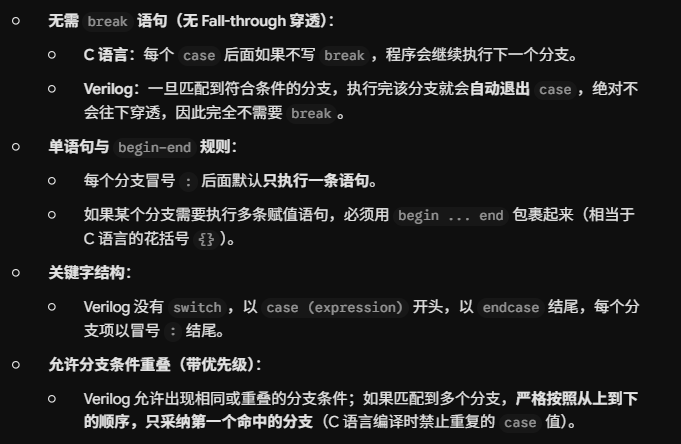
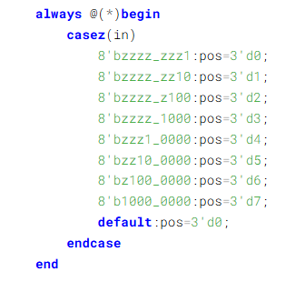
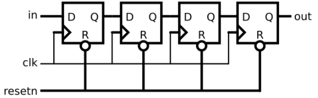
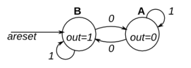

<h1 style="text-align: center;">一生一芯</h1>

# F阶段

## F5

### 实现GPR及其写入功能

1. 搭建RAM时，我一开始以为要跟ROM一样搭建8*8，后面问了一下ai，发现GPR是寄存器，我把概念弄混了。

|  部件   | 存放内容 | 容量计算依据 | 正确规格 |
| :-----: | :------: | :----------: | :------: |
|   ROM   | 存放指令 |   8条指令    |   8*8    |
| GPR/RAM | 存放变量 |  4个寄存器   |   4*4    |

2. __对于只有li指令的cpu来说：GPR搭建成4_4,是因为有4个寄存器，最后四位是要写进去的东西，不是搭建成4_8__

3. RAM的写使能逻辑是li指令，其余的使能端口应该接常量1

4. pc寄存器的输出端口累计一次更新应该接回ROM，执行下一步操作

5. clk要换成输入标签，不然在主电路中子电路可能没有时钟输入

### 添加add指令

1. 注意时钟，ROM不应该用寄存器时钟，直接输入，不然会慢一周期
2. li和add指令应该用数据选择器来输入

### 添加bner0指令

1. 到添加这个指令的时候发现了pc寄存器出现了问题，不能用单纯的计数器，不然不好跳转命令。
2. 必须在计数器的输入端来进行选择，不然会冲突
3. 有两根线接错了，我找了好久，一步一步测试才发现

### 和数列求和电路进行对比

|       对比维度       |             数列求和电路             |         scpu方案         |
| :------------------: | :----------------------------------: | :----------------------: |
| 电路灵活性与可扩展性 | 差，一旦改变上限，要重新修改硬件电路 |  极佳，只需要修改机器码  |
| 电路复杂度与硬件开销 |              低，器件少              |       较高，器件多       |
|   执行效率与周期数   |       极高，只需要10个时钟周期       | 较低，大概要40个时钟周期 |

### 设计一条让10个数相加的指令

1. 程序与通用性：通用性极差，程序无法复用
2. 指令集架构：字长受限，资源不足
3. cpu电路与硬件开销：资源浪费严重，拖慢时钟周期

## F6

### 实现增强版本的指令

1. 有符号的数直接相加就行，最高位会自动溢出

2. 代码逻辑

| PC地址 |  机器码  |    汇编指令    |                        执行逻辑                        |
| :----: | :------: | :------------: | :----------------------------------------------------: |
|   0    | 10000110 |  li  r0, 1, 2  |                   $r0 = 2 \ll 2 = 8$                   |
|   1    | 10110011 |  li  r3, 0, 3  |                   $r3 = 3 \ll 0 = 3$                   |
|   2    | 00000011 | add r0, r0, r3 |       $r0 = 8 + 3 = \mathbf{11}$（循环退出边界）       |
|   3    | 10110001 |  li  r3, 0, 1  |                $r3 = 1$（加数自增步长）                |
|   4    | 00101001 | add r2, r2, r1 |       **[循环入口]** 累加和更新：$r2 = r2 + r1$        |
|   5    | 00010111 | add r1, r1, r3 |               加数项自增：$r1 = r1 + 1$                |
|   6    | 11111001 |   br  r1, -2   | 若 $r0(11) \neq r1$，跳回 PC = $6 + (-2) = \mathbf{4}$ |
|   7    | 11000011 |   br  r3, 0    |                     原地死循环停机                     |

### 将计算结果输出到LED

1. 代码逻辑

| PC地址 |  机器码  |    汇编指令    |                        执行逻辑                        |
| :----: | :------: | :------------: | :----------------------------------------------------: |
|   0    | 10000110 |  li  r0, 1, 2  |                   $r0 = 2 \ll 2 = 8$                   |
|   1    | 10110011 |  li  r3, 0, 3  |                   $r3 = 3 \ll 0 = 3$                   |
|   2    | 00000011 | add r0, r0, r3 |      $ r0 = 8 + 3 = \mathbf{11}$（循环退出边界）       |
|   3    | 10110001 |  li  r3, 0, 1  |               $ r3 = 1$（加数自增步长）                |
|   4    | 00101001 | add r2, r2, r1 |        **[循环入口]** 累加和更新：r2 = r2 + r1         |
|   5    | 00010111 | add r1, r1, r3 |                加数项自增：r1 = r1 + 1                 |
|   6    | 11111001 |   br  r1, -2   | 若 $r0(11) \neq r1$，跳回 PC = $6 + (-2) = \mathbf{4}$ |
|   7    | 01101000 |  io  r2, 1, 0  |     [计算完成] 将求和结果 $r2$ 输出到 LED (dev 0)      |


### 从拨码开关中读入数列的末项

1. 对写入的RAM使能的时候，不能只看io指令的第5位，要看是io指令并且是第5位，不能只要是第5位就使能
2. __末项为0的情况__：当输入末项为 0 时，由于程序缺乏前置边界判断，且采用“先累加自增、后判断跳转”的循环结构，初始计算直接使计数器超过了设定的终止上限（$r0=1$），导致循环无法及时退出；计数器必须在累加中一路递增至 255 并发生 8 位无符号数溢出回卷归零后，才能在第二轮匹配到上限跳出循环，最终计算了 $0 \sim 255$​​ 的累加和，经 8 位数据截断后在数码管上错误显示为十六进制的 **`80`**（十进制 128），这是32640对256取的模.

3. 代码逻辑

| PC地址 |   机器码    |    汇编指令    |                        执行逻辑                        |
| :----: | :---------: | :------------: | :----------------------------------------------------: |
|   0    | 01 00 0 000 |  io  r0, 0, 0  |             从拨码开关读入末项 $N$ 到 $r0$             |
|   1    | 10 11 00 01 |  li  r3, 0, 1  |             加载常量 $r3 = 1$（自增步长）              |
|   2    | 00 00 00 11 | add r0, r0, r3 |             计算循环退出上限 $r0 = N + 1$              |
|   3    | 00 10 10 01 | add r2, r2, r1 |                累加求和 $r2 = r2 + r1$                 |
|   4    | 00 01 01 11 | add r1, r1, r3 |                加数项自增 $r1 = r1 + 1$                |
|   5    | 11 1110 01  |   br  r1, -2   | 若 $R[0] \neq R[1]$，跳回 PC = $5 + (-2) = \mathbf{3}$ |
|   6    | 01 10 1 001 |  io  r2, 1, 1  |             将累加和 $r2$ 输出到七段数码管             |
|   7    | 11 0000 11  |   br  r3, 0    |               原地死循环停机（锁定显示）               |

### 通过按钮控制结果的显示

1. 突然发现了我的br指令有点问题，我接了个非门然后再接到了写使能端口上，导致没有用这个指令的时候，写使能强制为1，写入了无关信号.

2. 我还发现我之前的ROM没想到这个要用12条指令，而我的只能储存8条指令，所以我用了库里面的ROM
3. 代码逻辑：

| PC地址 |  机器码  |    汇编指令    |                           执行逻辑                           |
| :----: | :------: | :------------: | :----------------------------------------------------------: |
|   0    | 01000000 |  io  r0, 0, 0  |                 读入拨码开关末项 $N$ 到 $r0$                 |
|   1    | 10110001 |  li  r3, 0, 1  |                  常量 $r3 = 1$（加数步长）                   |
|   2    | 00000011 | add r0, r0, r3 |                   设循环上限：$r0 = N + 1$                   |
|   3    | 00101001 | add r2, r2, r1 |          累加求和：$r2 = r2 + r1$（$r2$ 初始为 0）           |
|   4    | 00010111 | add r1, r1, r3 |     项计数自增：$r1 = r1 + 1$（$r1$ 初始为 0，加后为 1）     |
|   5    | 01011000 |  io  r1, 1, 0  |          **输出当前项 $r1$ 到 LED**（实时显示进度）          |
|   6    | 11110101 |   br  r1, -3   | 比对 $r0(N+1)$ 与 $r1$：若 $r1 \neq N+1$（未加完），跳回 PC = $6 + (-3) = \mathbf{3}$ |
|   7    | 10000000 |  li  r0, 0, 0  |   **[计算完毕]** 将 $r0$ 清零，作为“全 0（无按键）”的基准    |
|   8    | 01110001 |  io  r3, 0, 1  |           **[轮询起点]** 读入 8 位按钮状态到 $r3$            |
|   9    | 11001011 |   br  r3, 2    | 比较 $r0(0)$ 与 $r3$：**若 $r3 \neq 0$（有按键按下），跳到 PC = $9 + 2 = \mathbf{11}$** |
|   10   | 11111001 |   br  r1, -2   | 若无人按键（$r3 == 0$），利用 $r0(0) \neq r1(N+1)$ 恒成立，跳回 PC = $10 + (-2) = \mathbf{8}$ 继续等待 |
|   11   | 01101001 |  io  r2, 1, 1  |   **[按键触发后执行]** 将最终累加和 $r2$ 输出到七段数码管    |
|   12   | 11000001 |   br  r1, 0    |               原地死循环停机（锁定数码管显示）               |

4. 我的时钟要很快，才能按一下就显示，因为是轮询

### 实现单步求和

1. 代码逻辑

| PC地址 |  机器码  |    汇编指令    |                           执行逻辑                           |
| :----: | :------: | :------------: | :----------------------------------------------------------: |
|   0    | 10110001 |  li  r3, 0, 1  |  加载常量 $r3 = 1$（用于自增步长及最低位按键期望值 `0x01`）  |
|   1    | 01000000 |  io  r0, 0, 0  |                从拨码开关读入末项 $N$ 到 $r0$                |
|   2    | 00010111 | add r1, r1, r3 | **[主循环入口]** 当前项加数自增：$r1 = r1 + 1$（初次执行为 1） |
|   3    | 00101001 | add r2, r2, r1 |           累加求和：$r2 = r2 + r1$（初次执行为 1）           |
|   4    | 01011000 |  io  r1, 1, 0  |                    输出当前项 $r1$ 到 LED                    |
|   5    | 01101001 |  io  r2, 1, 1  |               输出当前累加和 $r2$ 到七段数码管               |
|   6    | 01000001 |  io  r0, 0, 1  |         **[按键轮询起点]** 读入 8 位按钮状态到 $r0$          |
|   7    | 11111111 |   br  r3, -1   | 比较 $r0$ 与 $r3(1)$：若 $r0 \neq 1$（未按下最低位），跳回 PC = $7 + (-1) = \mathbf{6}$ 等待 |
|   8    | 01000000 |  io  r0, 0, 0  |   **[按键触发后执行]** 重新从拨码开关读入末项 $N$ 到 $r0$    |
|   9    | 11100101 |   br  r1, -7   | 比较 $r0(N)$ 与 $r1$：若 $r1 \neq N$（未到末项），跳回 PC = $9 + (-7) = \mathbf{2}$（偏移 $-7$，合法） |
|   10   | 11000011 |   br  r3, 0    | 若 $r1 == N$（已达末项），不跳转顺延到 PC 10：**原地停机死循环** |
|   11   | 11000011 |   br  r3, 0    |                           占位填充                           |

### 实现单步求和（2）

1. 指令跳转的限制
2. 寄存器匮乏
3. 受限于 GPR 仅有 4 个且无独立条件码寄存器，实现边沿检测（按下+释放）所需的完整指令序列长度超过了 `bner0` 能够表示的最大负向跳转偏移（$-8$），且缺乏无条件跳转指令无法安全中转，因此在当前 CPU 架构下纯软件无法实现

# E阶段

## E1

### verilog基础入门

1. 


2. 


3. 


4. 


5. 


6. 


- 上面这两个最后的结果都是一样的，但是过程不一样，**一个**用了两个加法器和一个数据选择器；**另一个**用了两个数据选择器和一个加法器，加法器的面积大于数据选择器的面积，更麻烦。

7. 


8. 


9. 


10. 


11. **流水线，第一个触发器完成加法，第二个完成乘法**


12. **==parameter用于局部的定义，定义数据，定义位宽，这里面的#号的延时只是用于仿真，define用于全局定义==**


13. ==模块实例化==


14. ==[[复杂时序逻辑电路 - 数字电路教程](https://vlab.ustc.edu.cn/guide/doc_complex_timing.html)]:学习数电很好的经验总结==

### verilog语法

- 简单组合逻辑电路


- 多bit逻辑门电路


- 八输入与门


- 一位全加器


- 三态门：最下面的是数据表


- 八位数据选择器（用两个4位数据选择器实现）：lsbmux是第四位，msbmux是高四位，推荐使用第二种例化方式。例化就是调用你已经写好的，顶层对底层的调用。


- 这个上面的是位拼接

- D触发器


- 带同步复位的D触发器：复位只能发生在在 clk 信号的上升沿，若 clk 信号出现问题，则无法进行复位。


- 异步复位电路


- 七段数码管：==case 语句的各个条件之间没有优先级，且各条件应是互斥的。在组合逻辑电路中使用 case 语句最后应加上 default 语句，以防综合出锁存器电路。==


- 有限状态机


- 测试文件


- ```
  always @(posedge clk) begin
      #1; {a, b, c, yexpected} = testvectors[vectornum];
  end
  ```

  在时钟**上升沿**到来后，延迟 1 个时间单位（`#1` 用于模拟建立时间，避免亚稳态与竞争冒险），从数组中读取当前行的 4 个 bit，利用**位拼接**一次性分发给输入 `a, b, c` 以及期望结果 `yexpected`。

### HDLBits习题

- 关于assign赋值语句的语法

1. assign语句具有并发性
2. assign语句不是变量赋值，==而是导线搭建==

3. verilog模块端口默认wire类型
4. ==assign指令具有方向性==


- 关于向量

1. 向量相当于总线
2. ==声明位宽时，位宽范围在变量名的前面，读取位时索引下标在变量名的后面==
3. 向量的标准声明形式：

```
type [upper:lower] vector_name;
```

4. 小端序和大端序都可以，但是推荐使用小端序

5. 隐式线网：在 Verilog 中，如果你使用了一个**从未声明过（没写 `wire` 或 `reg`）的信号名**：

   - 编译器**不会直接报错**；
   - 而是会默认“擅作主张”地把它当成一个 **1 位宽的 `wire`（1-bit wire）**。
   - 可以使用下面这行代码解决

   ```
   `default_nettype none
   ```

   

6. 紧凑维度（Packed Dimension）：向量写在变量名之前的表示单条数据的位宽；非紧凑维度（Unpacked Dimension）：向量写在变量名之后的表示数组的元素个数 / 深度
7. 当赋值左右两边位宽不一样时：**左边宽、右边窄**：自动在**高位补 0 扩展**；**左边窄、右边宽**：会自动截断（Truncated）丢弃高位


- 关于多输入的异或门

1. ==奇数个 1 输出 1，偶数个 1 输出 0==
2. 代码

```
assign out_xor = ^in;  // 将向量 in 的所有位依次异或
```

或者

```
assign out_xor = in[0] ^ in[1] ^ in[2] ^ in[3];
```

- 向量连接

1. 通过大括号 `{ }` 将信号或常量用逗号隔开，==按从左到右的高低位顺序拼接==
2. ==必须显式指定每一项的位宽==
3. 向量连接还可以连乘，更加方便一点


<span style="
    color: #FFE600;
    font-size: 28px;
    letter-spacing: 6px;
    text-shadow: 0 0 8px #FFD700, 0 0 16px #FFA500;
">&#9733;&#9733;&#9733;</span>

这个是错误的，下标要一致，还是从大到小，如果是反转顺序，那么应该一个一个的写


- 符号位扩展：在有符号数（补码表示）中，当需要把一个**窄位宽**的数转换成**宽位宽**的数，且必须**保持原数值大小不变**时，需要进行符号位扩展

1. 将原数据的**最高有效位（MSB，即符号位）直接复制并填充到左侧的高位**。
2. **正数（符号位为 0）**：
   - 4 位数据 `4'b0101`（表示十进制 $+5$，符号位是 `0`）。
   - 扩展为 8 位：高位全部补 `0`，得到 `8'b00000101`（仍然是十进制 $+5$）。

3. **负数（符号位为 1）**：
   - 4 位数据 `4'b1101`（补码表示十进制 $-3$，符号位是 `1`）。
   - 扩展为 8 位：高位全部补 `1`，得到 `8'b11111101`（补码仍代表十进制 $-3$​）。
4. 代码实现

```
assign out = { {4{in[3]}}, in };
```

- wire和reg是互斥的数据类型，不能混在一起写
- 声明同位宽的多个向量时，位宽只需在最前面写一次即可
- always块中被赋值的变量必须是reg型，端口列表默认的是wire型
- always中不能有assign
- default语句的后面一定要有冒号，里面要有东西
- case的分支值一定要有位宽


- 例化的各个端口之间一定要用**（）**

- 模块的例化本质上是纯物理连线，不能赋值
- reg只能在过程块中赋值，如always和initial中，只有被赋值的东西才用reg的，赋给它的可以用wire


- case语句的基本规则

1. 一旦匹配到符合条件的分支，执行完该分支就会**自动退出 `case`**，绝对不会往下穿透，因此完全不需要 `break`。
2. 每个分支冒号 `:` 后面默认**只执行一条语句**；如果某个分支需要执行多条赋值语句，必须用 `begin ... end` 包裹起来（相当于 C 语言的花括号 `{}`）。
3. Verilog 没有 `switch`，以 `case (expression)` 开头，以 **`endcase`** 结尾，每个分支项以冒号 `:` 结尾。
4. erilog 允许出现相同或重叠的分支条件；如果匹配到多个分支，**严格按照从上到下的顺序，只采纳第一个命中的分支**（C 语言编译时禁止重复的 `case` 值）。
5. <span style="font-weight:bold;">==casez==</span>支持使用？或者z作为通配符，表示不管该位是0还是1

```
module top_module (
    input [3:0] in,
    output reg [1:0] pos
);

    always @(*) begin
        casez (in)
            4'bzzz1: pos = 2'd0; // 最低位为 1，优先输出 0
            4'bzz10: pos = 2'd1;
            4'bz100: pos = 2'd2;
            4'b1000: pos = 2'd3; // 最高位为 1
            default: pos = 2'd0; // 全 0 时输出 0
        endcase
    end

endmodule
或者
always @(*) begin
    casez (in[3:0])
        4'bzzz1: out = 0;   // in[3:1] can be anything
        4'bzz1z: out = 1;
        4'bz1zz: out = 2;
        4'b1zzz: out = 3;
        default: out = 0;
    endcase
end
或者
casez (in[3:0])
        4'bzzz1: ...
        4'bzz10: ...
        4'bz100: ...
        4'b1000: ...
        default: ...
    endcase
```



- 注意在always中begin和end1的位置关系以及endcase的位置关系

begin应该在always后面，case的前面

end应该在endcase的后面



- ==always里面也可以使用for循环，不过要先定义i，用integer==

```
 integer i;
    always @(*)begin
        for(i=0;i<100;i=i+1)begin
            out[i]=in[99-i];
        end
    end
    
```

- generate for循环块

1. 可以实例化多个模块
2. 循环变量必须声明为 `genvar`
3. **循环体必须命名（Named Block）**：
   - `for` 循环后面的 `begin` **必须带标签**，格式为 `begin : block_name`。
4. **步进表达式限制**：
   - Verilog 标准只支持 `i = i + 1`、`i = i - 1` 等显式赋值，不支持 `i++`。
5. 代码

```
module top_module( 
    input [99:0] a, b,
    input cin,
    output [99:0] cout,
    output [99:0] sum 
);

    genvar i;
    generate
        for (i = 0; i < 100; i = i + 1) begin : fadd_inst
            if (i == 0) begin
                // 第 0 位：进位输入接顶层的 cin
                fadd u_fadd (
                    .a(a[0]),
                    .b(b[0]),
                    .cin(cin),
                    .sum(sum[0]),
                    .cout(cout[0])
                );
            end
            else begin
                // 其余位：进位输入接上一位的进位输出 cout[i-1]
                fadd u_fadd (
                    .a(a[i]),
                    .b(b[i]),
                    .cin(cout[i-1]),
                    .sum(sum[i]),
                    .cout(cout[i])
                );
            end
        end
    endgenerate

endmodule

// 底层 1 位全加器
module fadd (
    input a, 
    input b, 
    input cin,
    output sum, 
    output cout
);
    assign sum  = a ^ b ^ cin;
    assign cout = (a & b) | (a & cin) | (b & cin);
endmodule
```

- ==在进行for循环的时候，i的上限一定要看清楚==
- ==例如为[99:0]的时候，i就要小于等于99或者小于100==


```
module top_module( 
    input [99:0] in,
    output [98:0] out_both,
    output [99:1] out_any,
    output [99:0] out_different );

    integer i;
    always @(*)begin
        for(i=0;i<99;i=i+1)begin
            if((in[i]==1)&(in[i+1]==1))begin
                out_both[i]=1;
                end
                else begin
                    out_both[i]=0;
                end
            
        end
        for(i=1;i<100;i=i+1)begin
            if((in[i]==1)|(in[i-1]==1))begin
                out_any[i]=1;
                end
                else begin
                    out_any[i]=0;
                end
            
        end
        for(i=0;i<99;i=i+1)begin
            if(in[i]^in[i+1]==1)begin
                out_different[i]=1;
                end
                else begin
                    out_different[i]=0;
                end
            out_different[99]=in[99]^in[0];
        end
    end
   
endmodule

```

- ==`in[sel*4 +: 4]` 等价于截取从 `sel*4` 开始的 **4 位**数据。==

1. 切片的两端禁止都是变量

2. **`sel\*4`**：起始索引位置（允许是**动态变量**）。

   **`+:`**：表示向上索引（Index-up）。

   **`4`**：截取的位宽（必须是**编译期常数**，确保硬件线宽固定）。

3. 代码

```
module top_module( 
    input [1023:0] in,
    input [7:0] sel,
    output [3:0] out 
);

    assign out = in[sel*4 +: 4];

endmodule
```

-  a和b可以直接相加，eg：assign {cout, sum} = a + b + cin;
  直接采用位拼接的形式，但是这个是==无符号的加法器==
- 有符号的加法器能够进行溢出检测（在补码运算中，两个正数相加得到负数或者两个负数相加得到正数）

- ==<u>补码，反码和原码</u>==

- **面对并行的时候不能使用if和else-if，这相当于case只能进入一个，==可以使用两个并行的if==**

```
 always @(posedge clk)begin
        if(resetn==0)begin
            q<=0;
        end
        else if(byteena[1]==1)begin
            q[15:8]<=d[15:8];
        end
        else if(byteena[0]==1)begin
            q[7:0]<=d[7:0];
        end
    end
```

```
always @(posedge clk) begin
        if (!resetn) begin
            // 同步低电平复位，清零所有 16 位
            q <= 16'h0;
        end
        else begin
            // 独立控制高 8 位写入
            if (byteena[1]) begin
                q[15:8] <= d[15:8];
            end
            
            // 独立控制低 8 位写入（不能用 else if）
            if (byteena[0]) begin
                q[7:0] <= d[7:0];
            end
        end
    end
```

- ==模块的例化肯定不能放在always过程块的内部，在 Verilog 中，模块例化是在描述**物理硬件芯片/模块的摆放与连线**，属于顶层并行结构；always里面只能写赋值的结构==

- 用D触发器搭建一个JK触发器的本质就是化简卡诺图

| **J** | **K** | **当前输出 Q** | **下一状态 Qnext(=D)** | **说明** |
| ----- | ----- | -------------- | ---------------------- | -------- |
| 0     | 0     | 0              | 0                      | 保持     |
| 0     | 0     | 1              | 1                      | 保持     |
| 0     | 1     | 0              | 0                      | 清零     |
| 0     | 1     | 1              | 0                      | 清零     |
| 1     | 0     | 0              | 1                      | 置 1     |
| 1     | 0     | 1              | 1                      | 置 1     |
| 1     | 1     | 0              | 1                      | 翻转     |
| 1     | 1     | 1              | 0                      | 翻转     |

​										$$D = J\overline{Q} + \overline{K}Q$$

- 正边沿检测：就是利用D触发器提前存一拍的特性
  这个是因为在同一个 `always @(posedge clk)` 块中，所有使用 `<=` 的语句是**并行发生、不分先后**的：

这个可以进行上升沿==检测==，不过这个pedge是马上变化的，只能存在一个周期

所以下面这两个语句同时发生，不分先后的。

```
always @(posedge clk) begin
        in_last <= in;                    // 记录上一周期的输入状态
        pedge   <= in & ~in_last;         // 当前为 1 且上一拍为 0，即检测到上升沿
    end
```

- 下面这个是下降沿==捕获==，能存在很久，直到复位按键按下
- 这个或门很关键，能一直存在

```
reg [31:0] in_last;

    always @(posedge clk) begin
        // 每个周期都记录上一拍的输入状态
        in_last <= in;

        if (reset) begin
            out <= 32'h0;
        end
        else begin
            // 保持原有的 1，并捕获新的 1->0 下降沿
            out <= out | (in_last & ~in);
        end
    end
```

- 如果用D触发器进行双边沿检测的话，可以弄一个选择器，选择正边沿或者负边沿

而不是用串联D触发器

```
reg p, n;

    // 上升沿触发
    always @(posedge clk) begin
        p <= d;
    end

    // 下降沿触发
    always @(negedge clk) begin
        n <= d;
    end

    // 根据当前时钟电平选择对应的采样值
    assign q = clk ? p : n;
```

- **`&&`：逻辑与（Logical AND）**
  - **作用对象**：把左右两边的表达式当成一个**整体的真假值（True / False）**。
  - **运算规则**：非 0 即为真（True/1），0 则为假（False/0）。
  - **输出结果**：结果永远是 **1 位的 `1'b1` 或 `1'b0`**。
  - **适用场景**：用于条件判断语句（如 `if (a > 3 && b < 5)`）或多个判断条件的逻辑组合。
- **`&`：按位与（Bitwise AND）**
  - **作用对象**：对左右两个向量的每一个二进制位（bit by bit）逐一进行与门运算。
  - **输出结果**：位宽与操作数相同。
  - **适用场景**：用于多位总线数据的门级逻辑操作（如 `8'b1100 & 8'b1010 = 8'b1000`）。

- 关于分频器，可以提前算好使能信号再连线

```
module top_module (
    input clk,
    input reset,
    output OneHertz,
    output [2:0] c_enable
);

    wire [3:0] q0, q1, q2;

    // 1. 各级计数器的使能信号推导
    assign c_enable[0] = 1'b1;
    assign c_enable[1] = (q0 == 4'd9);
    assign c_enable[2] = (q0 == 4'd9) && (q1 == 4'd9);

    // 2. 例化 3 个 BCD 计数器
    // 第 0 级 (最快)
    bcdcount counter0 (
        .clk    (clk),
        .reset  (reset),
        .enable (c_enable[0]),
        .Q      (q0)
    );

    // 第 1 级
    bcdcount counter1 (
        .clk    (clk),
        .reset  (reset),
        .enable (c_enable[1]),
        .Q      (q1)
    );

    // 第 2 级 (最慢)
    bcdcount counter2 (
        .clk    (clk),
        .reset  (reset),
        .enable (c_enable[2]),
        .Q      (q2)
    );

    // 3. 计满 999 时产生 1 Hz 使能信号
    assign OneHertz = (q0 == 4'd9) && (q1 == 4'd9) && (q2 == 4'd9);

endmodule
```

- 时钟进位，8位BCD计数器的标准增量逻辑

  对一个 8 位 BCD 变量（如秒 `ss[7:0]`）：

  - 当 `ss == 8'h59` 时，满 60 秒归 `8'h00`；
  - 当低 4 位（个位）`ss[3:0] == 4'd9` 时，个位归 0，十位加 1：`ss <= {ss[7:4] + 1'b1, 4'd0};`
  - 其余情况，个位直接加 1：`ss[3:0] <= ss[3:0] + 1'b1;`

  仍是二进制的加减，用16进制表示

- 代码

```
module top_module(
    input clk,
    input reset,
    input ena,
    output reg pm,          // 修复：添加 reg
    output reg [7:0] hh,
    output reg [7:0] mm,
    output reg [7:0] ss
); 

    wire enable1, enable2, enable3;
    
    assign enable1 = ena;
    assign enable2 = (ss == 8'h59) && ena;
    assign enable3 = (ss == 8'h59) && (mm == 8'h59) && ena;
    
    // 秒计数逻辑 (正确)
    always @(posedge clk) begin
        if (reset) begin
            ss <= 8'h00;
        end
        else if (enable1) begin
            if (ss == 8'h59) begin
                ss <= 8'h00;
            end
            else if (ss[3:0] == 4'd9) begin
                ss <= {ss[7:4] + 1'b1, 4'h0};
            end
            else begin
                ss[3:0] <= ss[3:0] + 1'b1;
            end
        end
    end
        
    // 分计数逻辑 (正确)
    always @(posedge clk) begin
        if (reset) begin
            mm <= 8'h00;
        end
        else if (enable2) begin
            if (mm == 8'h59) begin
                mm <= 8'h00;
            end
            else if (mm[3:0] == 4'd9) begin
                mm <= {mm[7:4] + 1'b1, 4'h0};
            end
            else begin
                mm[3:0] <= mm[3:0] + 1'b1;
            end
        end
    end
        
    // 小时与 PM 逻辑 (修正版)
    always @(posedge clk) begin
        if (reset) begin
            hh <= 8'h12;
            pm <= 1'b0;
        end
        else if (enable3) begin
            if (hh == 8'h11) begin
                hh <= 8'h12;
                pm <= ~pm;       // 11点到12点时翻转 PM
            end
            else if (hh == 8'h12) begin
                hh <= 8'h01;     // 12点跳回 1点
            end
            else if (hh[3:0] == 4'd9) begin
                hh <= {hh[7:4] + 1'b1, 4'h0};
            end
            else begin
                hh[3:0] <= hh[3:0] + 1'b1;
            end
        end
    end
     
endmodule
```

- for循环的步骤

**第 1 步：初始化（仅执行 1 次）**

- 执行初始化表达式（例如 `i = 0`），给循环控制变量赋初值。

**第 2 步：条件判定**

- 评估“循环继续条件”（例如 `i < 8`）。
- 若结果为 **真（1）**，进入第 3 步。
- 若结果为 **假（0）**，立即跳出循环，结束执行。

**第 3 步：执行循环体**

- 执行 `begin ... end` 内部的所有语句。

**第 4 步：步进更新**

- 执行步进表达式（例如 `i = i + 1`），更新循环控制变量的值。
- **返回第 2 步**，重新进行条件判定，开始下一次循环迭代


- 循环移动本质上就是拼接

```
always @(posedge clk) begin
        if (load) begin
            q <= data;
        end
        else begin
            case (ena)
                2'b01: q <= {q[0], q[99:1]};  // 右循环移位 1 位
                2'b10: q <= {q[98:0], q[99]};  // 左循环移位 1 位
                default: q <= q;               // 2'b00 和 2'b11 保持不变
            endcase
        end
    end
```

- 不用例化就能生成D触发器

1. 在 Verilog 语法规范与综合工具（如 Quartus, Vivado）的底层规则中：
   - **`always @(posedge clk)`**：在硬件语义上，这一行语句的含义就是“生成时钟上升沿敏感的寄存器结构（即 D-FF）”。
   - **左侧的变量（LHS）**：被赋值的变量（如 `q[4]`, `q[3]` 等）会被自动映射为对应 D 触发器的 **$Q$ 输出端**。
   - **右侧的表达式（RHS）**：赋值号右侧的逻辑（如 `q[3] ^ q[0]`）会被综合成组合逻辑门电路，并直接连到该 D 触发器的 **$D$ 数据输入端**。
   - **`if (reset)` 分支**：会自动连接到 D 触发器的同步复位/置位引脚。

2. 代码

```
always @(posedge clk) begin
    if (reset) begin
        q <= 5'h1;
    end
    else begin
        q[4] <= 1'b0 ^ q[0];  // 综合出 FF4：D端接 (0^q0)，Q端输出 q[4]，复位值为0
        q[3] <= q[4];         // 综合出 FF3：D端接 q[4]，  Q端输出 q[3]，复位值为0
        q[2] <= q[3] ^ q[0];  // 综合出 FF2：D端接 (q3^q0)，Q端输出 q[2]，复位值为0
        q[1] <= q[2];         // 综合出 FF1：D端接 q[2]，  Q端输出 q[1]，复位值为0
        q[0] <= q[1];         // 综合出 FF0：D端接 q[1]，  Q端输出 q[0]，复位值为1
    end
end
```

- ==在assign赋值语句中，不能使用非阻塞符号<=，只能使用等号===

==同时assign的被赋值的类型必须是wire类型的，不能是reg==

- 四级移位寄存器



```
module top_module (
    input clk,
    input resetn,   // synchronous reset
    input in,
    output out);

    reg [3:0]q;
    always@(posedge clk)begin
        if(!resetn)begin
            q<=4'h0;
        end
        else begin
            q[0]<=in;
            q[1]<=q[0];
            q[2]<=q[1];
            q[3]<=q[2];
        end
    end
    assign out=q[3];
                

            
    
    
endmodule

```

或者更加简便的方法

```
module top_module (
    input clk,
    input resetn,   // synchronous reset (active-low)
    input in,
    output out
);

    reg [3:0] q;

    always @(posedge clk) begin
        if (!resetn) begin
            q <= 4'b0000;
        end
        else begin
            // 新输入从最低位推入，高位逐位左移
            q <= {q[2:0], in};
        end
    end

    assign out = q[3];

endmodule
```

- ==always@(*)这个里面没有时钟，本质上就是组合逻辑，所以里面的赋值都要采用阻塞赋值“=”==

- [Conway's Game of Life](https://en.wikipedia.org/wiki/Conway's_Game_of_Life) 的代码，可以进行组合，前面用组合逻辑后面用时序逻辑来进行操作

```
module top_module(
    input clk,
    input load,
    input [255:0] data,
    output reg [255:0] q ); 

    reg [255:0]q_next;
    
    
    integer r,c;
    reg [3:0]r_up,r_down,c_left,c_right;
    reg [3:0]count;
    always@(*)
        for(r=0;r<16;r=r+1)begin
            for(c=0;c<16;c=c+1)begin
                r_up=(r==0)?15:r-1;
                r_down=(r==15)?0:r+1;
                c_left=(c==0)?15:c-1;
                c_right=(c==15)?0:c+1;
                
                count=q[r_up*16+c_left]+q[r_up*16+c]+q[r_up*16+c_right]
                +q[r*16+c_left]+q[r*16+c_right]
                +q[r_down*16+c_left]+q[r_down*16+c]+q[r_down*16+c_right];
            
                case (count)
                    4'h0:q_next[r*16+c]=1'b0;
                    4'h1:q_next[r*16+c]=1'b0;
                    4'h2:q_next[r*16+c]=q[r*16+c];
                    4'h3:q_next[r*16+c]=1'b1;
                    default:q_next[r*16+c]=1'b0;
                endcase
                end
        end
    always@(posedge clk)begin
        if(load)begin
            q<=data;
        end
        else begin
            q<=q_next;
        end
    end
                    
                    
    
            
endmodule

```

- 状态机分为组合逻辑和时序逻辑，组合逻辑负责次态的计算和输出；时序逻辑负责复位以及存储状态



```
module top_module(
    input clk,
    input areset,    // Asynchronous reset to state B
    input in,
    output out);//  

    parameter A=1'b0, B=1'b1; 
    reg state, next_state;

    always @(*) begin    // This is a combinational always block
        // State transition logic
        case (state)
            B:next_state=(in==1'b1)?B:A;
            A:next_state=(in==1'b1)?A:B;
        default:next_state=B;
        endcase
    end

    always @(posedge clk, posedge areset) begin    // This is a sequential always block
        // State flip-flops with asynchronous reset
        if(areset)begin
            state<=B;
        end
        else begin
        state<=next_state;
        end
        
    end

    // Output logic
    assign out=(state==B)?1:0;
    // assign out = (state == ...);

endmodule

```

- 状态机分为

  ==**Moore 状态机（摩尔型）**：==

  - ==输出 **仅取决于当前状态**（与当前输入无关==）。
  - 特点：输出更稳定、不易产生毛刺（Glitch），但响应输入通常会滞后 1 拍。

  ==**Mealy 状态机（米利型）**：==

  - ==输出 **同时取决于当前状态和当前输入**。==
  - 特点：响应输入更迅速（0 周期延迟），但输入端的毛刺可能会直接穿透到输出端。

- 状态机的状态就是现在的现象是什么，有几个现象就有几个状态

旅鼠的状态只有左和右

```
module top_module(
    input clk,
    input areset,    // Freshly brainwashed Lemmings walk left.
    input bump_left,
    input bump_right,
    output walk_left,
    output walk_right); //  

    // parameter LEFT=0, RIGHT=1, ...
    parameter left=0,right=1;
    reg state, next_state;
    always @(*) begin
        // State transition logic
        case(state)
            left:next_state=(bump_left==0)?left:right;
            right:next_state=(bump_right==0)?right:left;
            default:next_state=left;
        endcase
    end
    
  

    always @(posedge clk, posedge areset) begin
        // State flip-flops with asynchronous reset
        
        if(areset)begin
            state<=left;
        end
        else begin
            state<=next_state;
        end
    end

    // Output logic
    // assign walk_left = (state == ...);
    // assign walk_right = (state == ...);
    assign walk_left = (state == left);
    assign walk_right = ~walk_left;
    
    

endmodule

```

- case语句里面也能够进行ifelse的循环

```
case(state)
            left:begin
                if(!ground)
                    next_state=fall_left;
                else begin
                    if(bump_left)
                        next_state=right;
                    else
                        next_state=left;
                end
            end
            right:begin
                if(!ground)
                    next_state=fall_right;
                else begin
                    if(bump_right)
                        next_state=left;
                    else
                        next_state=right;
                end
            end
            fall_left:begin
                if(!ground)
                    next_state=fall_left;
                else 
                    next_state=left;
                end
            
            fall_right:begin
                if(!ground)
                    next_state=fall_right;
                else 
                    next_state=right;
                end
```

- 计数器只能放在时序逻辑里面，要有时钟才能计数，计数的时候一定要注意计数周期是多少

旅鼠不在下降状态的时候一定要清零，多写了一个死亡状态

这是单独的计数块

```
 
    always@(posedge clk or posedge areset)begin
        if(areset)begin
            count<=5'd0;
        end
        else if((state==fall_left)|(state==fall_right))begin
            if(count<5'd31)
                count<=count+5'd1;
        end
            else begin
                count<=5'd0;
        end
    end
```

这是进入状态的条件

```verilog
 fall_left:begin
                    
                 if(!ground)
                    next_state=fall_left;
                else if((count>19)&(ground==1))
                    next_state=dead;
                else 
                    next_state=left;
                end
            
            fall_right:begin
                
                 if(!ground)
                    next_state=fall_right;
                else if((count>19)&(ground==1))
                    next_state=dead;
                else
                    next_state=right;
                end
```

- 独热码就是每一位表示一个状态

```
module top_module(
    input in,
    input [9:0] state,
    output [9:0] next_state,
    output out1,
    output out2
);

    assign next_state[0] = (state[0] | state[1] | state[2] | state[3] | state[4] | state[7] | state[8] | state[9]) & (~in);
    assign next_state[1] = (state[0] | state[8] | state[9]) & in;
    assign next_state[2] = state[1] & in;
    assign next_state[3] = state[2] & in;
    assign next_state[4] = state[3] & in;
    assign next_state[5] = state[4] & in;
    assign next_state[6] = state[5] & in;
    assign next_state[7] = (state[6] | state[7]) & in;
    assign next_state[8] = state[5] & (~in);
    assign next_state[9] = state[6] & (~in);

    assign out1 = state[8] | state[9];
    assign out2 = state[7] | state[9];

endmodule
```

- 数据包接收

分为四个状态：搜索；字节2；字节3；完成

1个字节有8位，只检测第4位是不是1

要存字节的话在时序逻辑块里面存储

丢掉高的7位数据

```
 always@(posedge clk)begin 
        if(reset)begin
        state<=search;
        q<=24'b0;
        end
        	else begin
                state<=next_state;
                q<={q[15:0],in};
            end
        
    end
```

- 在数据比较多的时候，可以使用计数器计数的方式来消耗中间的数据位

==但是8位数据，计数器只用计到7就行==

```
 always@(posedge clk)begin
        if(reset)begin
            count<=5'd0;
        end
        else begin
            if(state==receive_data)
            count<=count+5'd1;
            else 
                count<=5'd0;
        end
    end
    
```

- 再接受数据的时候要注意方向，先发送的是什么数据

低位先行

```
data <= {in, data[7:1]};
```

高位先行

```
data<={data[6:0],in};
```

- 进行奇偶校验的时候，奇偶校验器的复位应该不能和全局一样

校验可以等到stop位校验，这样就能9位校验了

- 在进行同步帧处理的时候，应该给每个位都弄一个状态，防止中途有错误

```
always@(*)begin
        case (state)
            none:next_state=in?none:one0;
            one0:next_state=in?one1:one0;
    		one1:next_state=in?one2:one0;
            one2:next_state=in?one3:one0;
            one3:next_state=in?one4:one0;
            one4:next_state=in?one5:one0;
            one5:next_state=in?one6:DISC;
            one6:next_state=in?ERR:FLAG;
            DISC:next_state=in?one1:one0;
            FLAG:next_state=in?one1:one0;
            ERR:next_state=in?ERR:one0;
                default:next_state=one0;
        endcase 
    end
```

- mealy型输出是要同步的，相当于依当前的输入和状态；moore型输出是要下一周期的，只依赖当前的状态

- ==原码变成补码的硬件流扫描法==（只有两个状态）

这是在做串行有限状态机（Serial FSM）题目时最直观的逻辑：

1. 从最低有效位（LSB，最右侧）开始向左扫描；
2. **遇到第一个 `1` 之前的所有 `0`，以及这第一个 `1` 本身，原样保持不变**；
3. **在第一个 `1` 之后的所有更高位（除符号位外），全部按位取反（0 变 1，1 变 0）**。

**示例**：原码 `1000_1100`

1. 从右向左看，末尾是 `...100`（包含了第一个 1 以及它右边的 0，**保持原样 `100`**）；

2. 第一个 1 左边的高位是 `1000_`，将其数值部分取反变为 `1111_`；

3. 组合起来即为补码：`1111_0100`。

4. 不能直接求反，会造成锁存器，设置三个状态，==分别是未遇到1，输出0和输出1==，==mealy的只有2个状态就行，如果是moore就一定要有3个状态==

```
module top_module (
    input clk,
    input areset,    // Asynchronous active-high reset
    input x,
    output z
); 

    // 状态定义：A为未遇1；B为输出1态；C为输出0态
    parameter A = 2'd0,
              B = 2'd1,
              C = 2'd2;

    reg [1:0] state, next_state;

    // 1. 次态组合逻辑
    always @(*) begin
        case (state)
            A: next_state = x ? B : A;
            B: next_state = x ? C : B;
            C: next_state = x ? C : B;
            default: next_state = A;
        endcase
    end

    // 2. 异步高电平复位时序逻辑
    always @(posedge clk or posedge areset) begin
        if (areset)
            state <= A;
        else 
            state <= next_state;
    end

    // 3. Moore 输出逻辑（输出只由当前状态决定）
    assign z = (state == B);

endmodule
```

- 计数器计数的时候一定要注意周期,对于多拍寄存器，采用多个状态存储每个值

只用一个计数器，来计算周期，另一个用存储器存储

```
module top_module (
    input clk,
    input reset,    // Synchronous reset
    input s,
    input w,
    output reg z
);

    parameter A = 1'b0, B = 1'b1;
    reg state;
    reg [1:0] count;
    reg w0, w1;

    // 1. 状态跳转：在 A 状态等待 s=1，进入 B 后常驻
    always @(posedge clk) begin
        if (reset)
            state <= A;
        else if (state == A)
            state <= s ? B : A;
    end

    // 2. 周期计数器：进入 B 状态后，以 0 -> 1 -> 2 -> 0 严格循环
    always @(posedge clk) begin
        if (reset || (state == A))
            count <= 2'd0;
        else if (count == 2'd2)
            count <= 2'd0;
        else
            count <= count + 2'd1;
    end

    // 3. 记录采样值并输出：
    // count == 0 拍：记录第 1 拍的 w 到 w0
    // count == 1 拍：记录第 2 拍的 w 到 w1
    // count == 2 拍：此时已有 w0, w1，且当拍输入为 w，直接在时钟沿锁存 (w0+w1+w==2) 给 z
    always @(posedge clk) begin
        if (reset || (state == A)) begin
            w0 <= 1'b0;
            w1 <= 1'b0;
            z  <= 1'b0;
        end else begin
            case (count)
                2'd0: begin
                    w0 <= w;
                    z  <= 1'b0;
                end
                2'd1: begin
                    w1 <= w;
                    z  <= 1'b0;
                end
                2'd2: begin
                    // 在第 3 拍结束的时钟沿打拍输出，下一拍立即生效
                    z  <= ((w0 + w1 + w) == 2'd2);
                end
            endcase
        end
    end

endmodule
```

## E2 c语言程序设计

### 程序的基本概念

1. 程序和编程语言

|                |                                      |                                                  |
| :------------: | :----------------------------------: | :----------------------------------------------: |
|      维度      |              解释型语言              |                    编译型语言                    |
|    执行速度    |                  慢                  |                        快                        |
| 启动与调试周期 |               及时启动               |                   需要等待编译                   |
|  跨平台便利性  |              依赖解释器              |                   需要单独编译                   |
| 内存与资源占用 |                 较高                 |                       极低                       |
|   源码保密性   |                 较差                 |                       较好                       |
| 类型与错误检查 | 多为动态类型，错误常延后至运行时暴露 | 多为静态类型，绝大多数语法与类型错误在编译期拦截 |

   

2. floor在c语言中是取下的意思

   cerling在c语言中是取上的意思

3. 注意scanf的输入的不同类型的，不同的数据类型对应不同的占位符

| **数据类型**     | **C 语言声明**     | **对应占位符** | **取地址符** | **示例代码**                         |
| ---------------- | ------------------ | -------------- | ------------ | ------------------------------------ |
| **标准整型**     | `int`              | `%d` 或 `%i`   | `&`          | `int a; scanf("%d", &a);`            |
| **无符号整型**   | `unsigned int`     | `%u`           | `&`          | `unsigned int a; scanf("%u", &a);`   |
| **短整型**       | `short`            | `%hd`          | `&`          | `short a; scanf("%hd", &a);`         |
| **长整型**       | `long`             | `%ld`          | `&`          | `long a; scanf("%ld", &a);`          |
| **超长整型**     | `long long`        | `%lld`         | `&`          | `long long a; scanf("%lld", &a);`    |
| **单精度浮点型** | `float`            | `%f`           | `&`          | `float f; scanf("%f", &f);`          |
| **双精度浮点型** | `double`           | **`%lf`**      | `&`          | `double d; scanf("%lf", &d);`        |
| **长双精度浮点** | `long double`      | `%Lf`          | `&`          | `long double ld; scanf("%Lf", &ld);` |
| **单个字符**     | `char`             | `%c`           | `&`          | `char c; scanf("%c", &c);`           |
| **字符串**       | `char[]` / `char*` | `%s`           | **无需 `&`** | `char str[20]; scanf("%s", str);`    |
| **十六进制整数** | 整型               | `%x` 或 `%X`   | `&`          | `int a; scanf("%x", &a);`            |
| **八进制整数**   | 整型               | `%o`           | `&`          | `int a; scanf("%o", &a);`            |

4. *形参相当于函数中定义的变量，调用函数传递参数的过程相当于定义形参变量并且用实参的值来初始化*

### 简单函数

1. 习题3.1

修改的形参只是局部变量，没有改变main中当前的的i和j，应该使用指针

2. 习题3.2

不包含头文件会产生隐式函数声明


3. ```
   #include <stdio.h>
    
   void foo(void)
   {
       int i;
       printf("%d\n", i);
       i = 777;
   }
    
   int main(void)
   {
       foo();
       foo();
       return 0;
   }
   
   int main(void)
   {
       foo();
       printf("hello\n");
       foo();
       return 0;
   }
   ```

   上面两份代码的答案不一样是因为**读取未初始化的局部变量属于未定义行为（Undefined Behavior, UB）**，而在底层的函数调用栈（Call Stack）中，**中间插入的 `printf("hello\n");` 破坏了栈帧中原本残留的数据**。

### 分支语句

1. 4.1习题

第 2 行的 `if (x > 0);` 后面多写了一个**分号 `;`**

完全合法
